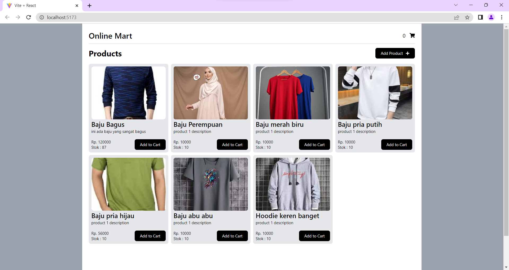
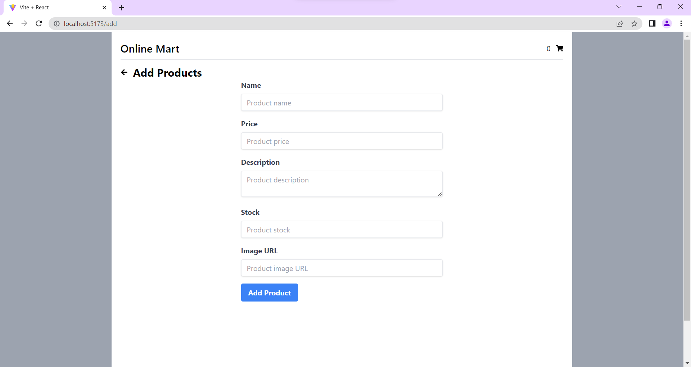
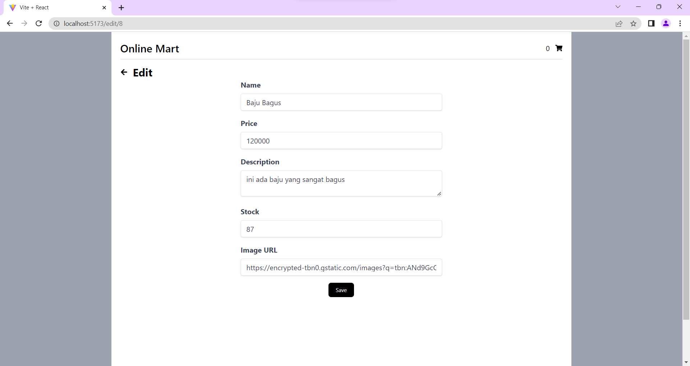
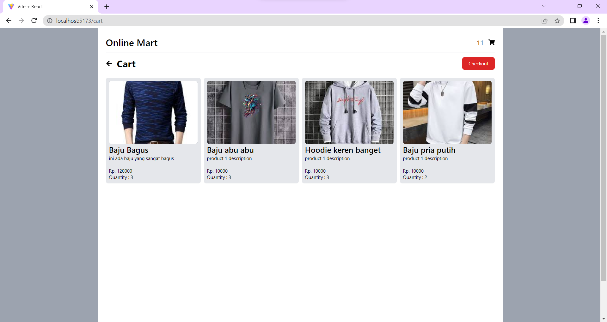
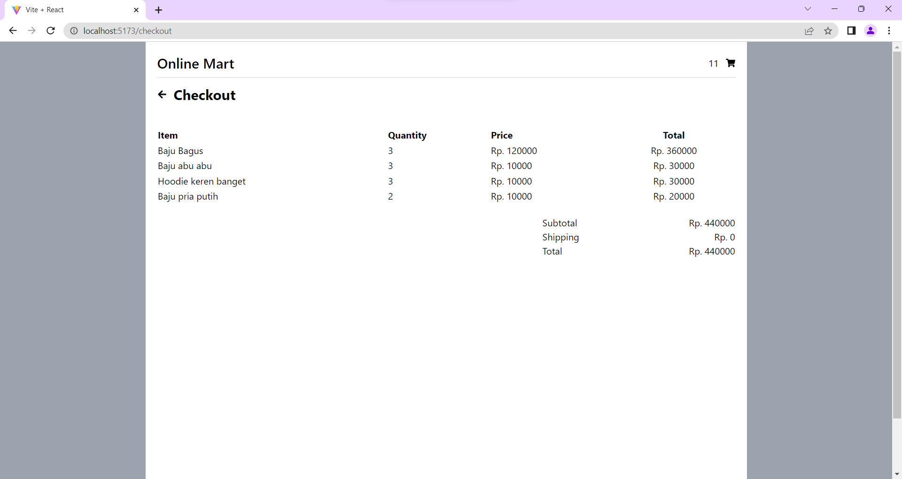

# uts front end

## cara menjalankan

1. clone repository ini `git clone https://github.com/PoohNoCounter/frontend_utspwl`
2. masuk ke folder `cd frontend_utspwl`
3. install dependencies `npm install`
4. jalankan `npm run dev`
5. buka browser dan masuk ke `localhost:3000`

## ss

- beranda
  

- tambah data
  

- edit data
  

- halaman keranjang
  

- halaman checkout
  
